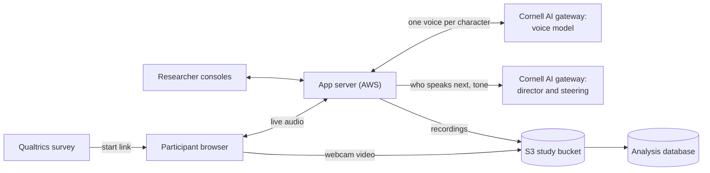

# Relational Fluency

Relational Fluency is a research platform from the Cornell **AI-Ready Workforce Initiative** (PI Kizilcec, IRB0151104). A participant has four voice conversations with AI characters in workplace situations, each lasting 7–12 minutes. The platform records the participant's audio, transcript and webcam video. The recordings are used to measure **relational fluency**: how well a person handles the relationship side of work. This repository holds the voice app, the scenario specs and the AWS deployment.

The design follows *Study Design Proposal v2* (Lee, Chun, Zhang, Slama, Joachims, Kizilcec).

**Status (2026-09-23):** the platform is built and the pilot has not run yet. Live app: <https://rf.ai-ready-workforce.ai.cornell.edu> (`/health` shows the status and the live model). Contact: the study team (PI Kizilcec).

## Study phases

| Phase | What happens | Status |
|---|---|---|
| 0 Platform | Build the voice app, the eight scenarios and the survey links, then pilot with 5–10 people | In progress; pilot not yet run |
| 1 Collect ([Study 1](docs/study1-plan.md)) | 100 participants × 4 encounters = 400 encounters, each with video, audio and transcript | Pre-pilot |
| 2 Human gold labels | 2–3 human raters score each video on the ESCI items. We check that they agree before any modelling. Experts also rate about 40 encounters | Not started; written ESCI permission pending ([`studies/study1/qualtrics/rating-instrument.md`](studies/study1/qualtrics/rating-instrument.md)) |
| 3 Scorer and feedback | Build an automatic scorer and compare it with the human raters. The feedback quotes 2–3 moments, each with a better alternative | Not started |
| 4 RCT | Attempt 1, then feedback or self-reflection, then attempt 2 (planned on the unseen form B). The outcome is the change in score | Not started; arms, N, and same vs. parallel form still open |

**Study 1, from the participant's side**
1. CloudResearch Connect recruits the participant.
2. Qualtrics Survey 1 takes consent and the self-report battery. Its last page opens the app.
3. The app runs a camera and microphone check, then four encounters.
4. A completion screen shows a code.
5. Qualtrics Survey 2 follows, then the participant goes back to CloudResearch to finish. *This hand-off is not configured yet: `SURVEY_RETURN_URL` is unset, so for now the app does not send participants back to Qualtrics.*

The app has no consent step of its own. The Qualtrics `ResponseID` (`qid`) links each run to its survey response. Each encounter runs 7–12 minutes, with a hard stop at 13:00, and the participant can withdraw at any time.

Study 1 details and open items are in [`docs/study1-plan.md`](docs/study1-plan.md) (§8). The later phases are in [`docs/roadmap.md`](docs/roadmap.md).

## Scenarios

The four constructs come from the ESCI **Relationship Management** cluster, with one scenario for each. Empathy and Organizational Awareness are built into every scenario. Each construct has two matched versions of the same difficulty, form A and form B. Each scenario sets up specific moments that raters score against the ESCI items. There are 22 items in all: 5 Conflict Management, 6 Influence, 5 Inspirational Leadership and 6 Teamwork.

**Study 1 uses form A only.** Every participant does all four scenarios in one of four counterbalanced orders (a Williams design), and the order is saved with the run. Form B is held back for a later retest.

| | Construct | Scenario (form A) | Characters |
|---|---|---|---|
| S1 | Conflict Management | Taken credit | Riley for a fixed 2 minutes, then Sam (both one-on-one) |
| S2 | Influence | Promised raise | Morgan (one-on-one) |
| S3 | Inspirational Leadership | After resignations | Alex, Jordan, Casey (one group meeting) |
| S4 | Teamwork | Internal rollout | Dan, Priya, Chris (one group meeting) |

**S1 Taken credit.** Your peer Sam has again presented your analysis to leadership as his own, after you privately asked him to credit you. Riley pushes you to hit back. After two minutes she leaves, and you run into Sam by the elevators.
*Assessed on:* raising the issue with Sam directly instead of retaliating or letting it go, de-escalating, and handling Sam's half-concession.

**S2 Promised raise.** You were promised a raise that never came, and your workload has grown. You hold a written competing offer, and a peer was kept last quarter with an off-cycle raise. Morgan will not mention either unless you do. Morgan deflects with a series of objections (budget, precedent, fairness).
*Assessed on:* anticipating objections, changing approach as they come, appealing to Morgan's interests, using the offer as leverage without threatening, and closing on a date.

**S3 After resignations.** You are the interim lead of a three-person team after two colleagues quit over pay. There are no new resources, and pay cannot be discussed. In one team meeting, Alex challenges you publicly, Jordan says he is "fine", and Casey is overloaded.
*Assessed on:* being honest instead of spinning, meeting the challenge, building pride the team can believe, drawing out Jordan, steadying Casey, and making specific commitments you own.

**S4 Internal rollout.** In a four-person planning session, Dan's draft schedule is already on the table. Dan talks over Priya, who has the key insight, and relabels Chris's idea as his own.
*Assessed on:* noticing the exclusion without being prompted, bringing Priya's point back, correcting the credit without humiliating Dan, and ending with a fair split of the work with a named owner for each part.

The form B scenarios, the per-form moments and the ESCI item keys are in [`docs/scenario-map.md`](docs/scenario-map.md). The design rules are in [`docs/scenario-spec-v3.md`](docs/scenario-spec-v3.md).

## App architecture



- **Participant page:** [`static/v2.html`](static/v2.html) holds the situation card, the camera and mic check, the live conversation with captions and a timer, and the completion and withdrawal screens.
- **App server:** [`server/`](server/) (FastAPI). It serves the pages, runs each encounter and keeps the gateway key server-side.
- **Live voice:** `gpt-realtime-2.1` through Cornell's LiteLLM gateway, with one AI voice per character. The group scenes (S3, S4) also run a silent transcriber for the participant.
- **Director and steering:** a text model picks who speaks next in group scenes and can shift a character's tone by one step after a turn. Every decision is logged with a reason.
- **Scenarios:** [`scenarios/v3/*.yaml`](scenarios/v3/), compiled into a prompt for each character.
- **Hosting:** AWS (`us-east-1`) with encrypted storage. Everything is defined in [`infra/terraform/`](infra/terraform/). Details are in [`docs/DEPLOY-AWS.md`](docs/DEPLOY-AWS.md).

**Models:** voice `gpt-realtime-2.1`; director and steering `nto.gemini-3.5-flash-lite`; offline re-transcription `nto.gemini-3.8-flash`. `/health` and each encounter's `provenance` show what actually ran. The models were compared in [`docs/model-benchmark-2026-09-23.md`](docs/model-benchmark-2026-09-23.md).

## Where the data is

- **Recordings** (audio, transcript, event log, aligned record) are written during the session and archived when it closes to `s3://relational-fluency-study-data/encounters/<session_id>/`.
- **Webcam video** goes to the same bucket, normally uploaded straight from the browser. It is never sent to a model.
- **Better transcripts:** after a session, participant audio is transcribed again offline with `nto.gemini-3.8-flash`, which is more accurate than the live captions.
- **Analysis database:** RDS Postgres, loaded from S3 by `tools/load_analysis_db.py`. S3 remains the record. The schema is in [`docs/db-schema.md`](docs/db-schema.md).
- **Cohorts:** each run is tagged `study` (real participants), `internal` (team tests) or `unattributed` (real participants whose Qualtrics ID was missing). Check for `unattributed` runs early in every wave, because filtering to `study` alone hides them.
- **Retention:** recordings are kept until someone deletes them by hand (PI decision, 2026-09-17). Withdrawal requests are also handled by hand. See [`docs/OPERATIONS.md`](docs/OPERATIONS.md).
- **Access:** the researcher key is the Secrets Manager secret `relational-fluency/agent-api-key`.

## Links

| Who | Link |
|---|---|
| Participant, from Qualtrics | `https://rf.ai-ready-workforce.ai.cornell.edu/start?pid=${e://Field/participantId}&qid=${e://Field/ResponseID}` |
| Team member, test run | `https://rf.ai-ready-workforce.ai.cornell.edu/test?name=YOURNAME&key=RESEARCHER_KEY` |
| Researcher, live console | `https://rf.ai-ready-workforce.ai.cornell.edu/researcher?key=RESEARCHER_KEY` |
| Anyone, health and live model | `https://rf.ai-ready-workforce.ai.cornell.edu/health` |

The other operator tools (`/director`, `/evidence`, `/v2?scenario=`) and wave procedures are in [`docs/OPERATIONS.md`](docs/OPERATIONS.md).

## Run it locally

Python 3.11–3.13 (3.12 is the reference). One block per shell; they are not interchangeable.

```bash
# macOS / Linux
python3 -m venv .venv
source .venv/bin/activate
pip install -r requirements.txt
cp .env.example .env        # set ANTHROPIC_API_KEY (the Cornell LiteLLM key) and REALTIME_MODEL=gpt-realtime-2.1
python -m server.app
```

```powershell
# Windows PowerShell (if activation is refused: Set-ExecutionPolicy -Scope Process RemoteSigned)
py -3.12 -m venv .venv
.\.venv\Scripts\Activate.ps1
pip install -r requirements.txt
Copy-Item .env.example .env
python -m server.app
```

```bat
:: Windows Command Prompt
py -3.12 -m venv .venv
.venv\Scripts\activate.bat
pip install -r requirements.txt
copy .env.example .env
python -m server.app
```

Open <http://127.0.0.1:8765/health>, then <http://127.0.0.1:8765/start?pid=selftest1&cohort=internal>. Keep port 8765: it is the only local origin the study bucket accepts uploads from. Local webcam tests upload to the real study bucket. The full walkthrough is in [`docs/TESTING-LOCALLY.md`](docs/TESTING-LOCALLY.md).

## Browsers

Participants come from the public, so all three are required targets:

|  | macOS | Windows | Linux |
|---|---|---|---|
| **Chrome** | supported | supported | supported |
| **Firefox** | supported | supported | supported |
| **Safari** | supported | Safari does not exist on this OS | Safari does not exist on this OS |

## Docs

**For researchers**
- [`docs/study1-plan.md`](docs/study1-plan.md): Study 1 plan, decisions and open items. Its encounter-shape table is stale for S3A: S3A is now one group meeting and the order is Williams-counterbalanced.
- [`docs/roadmap.md`](docs/roadmap.md): phases beyond Study 1. Its Phase 0 checklist predates gpt-realtime-2.1 and the current storage.
- [`docs/scenario-map.md`](docs/scenario-map.md): forms A and B, the moments raters score, ESCI item keys
- [`docs/competency-framework.md`](docs/competency-framework.md): the constructs and ESCI items
- [`docs/db-schema.md`](docs/db-schema.md): the analysis database

**For engineers**
- [`docs/architecture.md`](docs/architecture.md): components in depth. It still describes the Gemini Live setup that came before gpt-realtime-2.1.
- [`docs/OPERATIONS.md`](docs/OPERATIONS.md): running a wave and operating the deployment
- [`docs/DEPLOY-AWS.md`](docs/DEPLOY-AWS.md): the AWS stack and releases
- [`docs/TESTING-LOCALLY.md`](docs/TESTING-LOCALLY.md): running the study on your own machine
- [`docs/scenario-spec-v3.md`](docs/scenario-spec-v3.md): how an encounter is designed
- [`docs/model-benchmark-2026-09-23.md`](docs/model-benchmark-2026-09-23.md): text-model benchmark
- [`docs/field-notes.md`](docs/field-notes.md): findings from driving the realtime models (mostly the earlier Gemini Live route)
