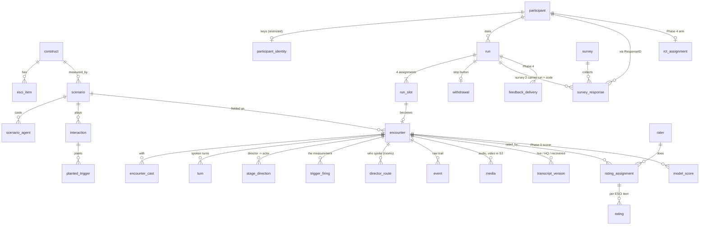

# Analysis database schema (draft 1)

Draft of 2026-09-22. DDL is in [`db-schema.sql`](db-schema.sql) (PostgreSQL;
loads clean on Postgres 16). This is a proposal for review, not something the
app uses yet.

## Scope: what this database is for

The platform keeps its operational data as **files**: one folder per encounter
on the EFS volume (`events.jsonl`, `record.json`, `manifest.json`, WAV audio),
a run document per participant, a participant record per key, all archived to
`s3://relational-fluency-study-data/encounters/<session_id>/` when the
encounter closes, with the webcam video already there. That stays as it is;
it is the record of what happened and it is verified per encounter.

The database is the **analysis layer** loaded from those files plus the
Qualtrics exports: one place to answer "how many participants finished all
four encounters", "which ESCI items did S3A actually exercise", "give me every
turn where Morgan fired the rung-3 beat and what the participant said back",
and later to hold the human ratings and model scores that Phases 2 and 3
produce. Nothing in it is a source of truth that the files are not.

Suggested engine: **PostgreSQL** (RDS in the study account, or a local
instance loaded from the S3 archive for a single analyst). The same DDL runs
on DuckDB with minor edits for quick exploration straight off the archive.

## The shape

Nine groups, in the order the DDL declares them:

| Group | Tables | What it holds |
|---|---|---|
| 1 Scenario bank | `construct`, `esci_item`, `scenario`, `scenario_agent`, `interaction`, `planted_trigger` | The instrument: the eight forms, their casts (with the per-family voice and the actor brief), the two interactions each, the planted triggers with their high/low anchors and the ESCI items each maps to. Loaded from `scenarios/v3/*.yaml` and fingerprinted, so an encounter can say exactly which version of a scenario it ran. ESCI items key on the construct because parallel forms share them (checked across all four pairs). |
| 2 People and runs | `participant`, `participant_identity`, `run`, `run_slot`, `withdrawal` | One row per participant record; identity keys (CloudResearch id, how it arrived) split into a restricted table. A run is the four-slot assignment with its arm, Williams-square row, and the steering records (`form_exclusions`, `construct_pool`, `variants`) kept verbatim; slots exist whether or not the encounter happened, so dropout is visible by position. `withdrawal` is the stop-button stamp: when, why, in which encounter, how far the run had got, and which run they actually pressed it on. |
| 3 Encounters | `encounter`, `encounter_cast`, `turn`, `stage_direction`, `trigger_firing`, `director_route`, `event` | The conversation as recorded: every turn on both sides, each stage direction paired to the reply it produced, each planted trigger as it fired or was retracted (`trigger_undelivered`), who the director chose to speak on each participant turn, and the raw event trail for everything else. Provenance (gateway, live model, director model, deploy revision, spec fingerprint) and the integrity counts from `record.json` live on the encounter row. |
| 4 Media and transcripts | `media`, `transcript_version` | Pointers to the audio and video objects in S3 (files never go in the database), and the alternative transcripts: the live one, the offline retranscription of the participant channel (`participant_transcript_hq`), and the dialogue recovered from video for the encounters whose records were lost before EFS. |
| 5 Surveys | `survey`, `survey_response` | Qualtrics Survey 1 and Survey 2 responses, joined to the run by ResponseID (Survey 1) and by the run id and completion code piped back (Survey 2). Answers stay as JSON until the instrument scoring is decided. |
| 6 Ratings and scores | `rater`, `rating_assignment`, `rating`, `model_score` | Phase 2: which rater watched which encounter, one score per ESCI item with the turns they pointed at. Phase 3: the model scorer's item scores, versioned so runs can be compared against the human ratings. |
| 7 RCT | `rct_assignment`, `feedback_delivery` | Phase 4: arm per participant, second attempts (`run.attempt_number`, `run.sibling_run_id`), and what feedback was delivered when. |
| 8 Operations | `deployment` | Task-definition revisions with their image and models, so an analysis can bracket encounters by what was running. |
| 9 Views | `v_encounter_summary`, `v_participant_progress`, `v_esci_coverage` | The three questions asked most often. |

## Where each column comes from

| Source | Loads into |
|---|---|
| `data/runs/<run_id>.json` | `run` (`run_id`, `participant_id`, `cohort`, `created_at`, `order.scheme/row`, `construct_pool` (+ its `arm`), `form_exclusions`, `variants`, `qualtrics_id` → `survey1_response_id`, `other_arm_runs`; `completion_code` derived with `runs.completion_code()`), `run_slot` (from `scenarios[]` and `completed[]`), `withdrawal` (from `withdrawn{at, reason, session_id, index, completed, withdrawn_on_run}`), `participant_identity.participant_key_status` / `raw_participant_key` |
| `data/participants/<pid>.json` | `participant` (`id`, `created_at`, `cohort`, `run_id` → `minted_for_run_id`, `withdrawn.at`), `participant_identity.participant_key` (= `code`) |
| `manifest.json` | `encounter` timing, `status`, `agent_ids`, `spec_fingerprint` |
| `record.json` | `encounter` (`provenance`, `counts`, `participant_channel`, `video_upload`), `encounter_cast` (from `cast[]`), `turn` (from `transcript[]`), `stage_direction` (from `steering_log[]`; `reply_turn_id` resolved by `turn`), `transcript_version` (`participant_transcript_hq`), `media` (from `audio`, `video`) |
| `events.jsonl` | `trigger_firing` (`trigger_fired` netted against `trigger_undelivered` on `index`), `director_route`, `turn.latency_s` / `audio_ms` / `garbled` / `script_mismatch`, and every line into `event` |
| `encounters/<id>/webcam.webm` (S3 listing) | `media` rows of kind `webcam_video` |
| `encounters/<id>/recovered_transcript.md` | `transcript_version` with source `recovered_from_video` |
| `python -m server.qualtrics export` / `join` | `survey`, `survey_response` (embedded data and answers verbatim; `participant_id` resolved through the run) |
| `scenarios/v3/*.yaml` | group 1: `construct`, `esci_items{}` → `esci_item`, `agents{}` → `scenario_agent`, `interactions[]` → `interaction`, `interactions[].triggers[]` → `planted_trigger` (`scores.high/low.answer/why` → the four anchor columns) |
| ECS task-definition history | `deployment` |

A loader is one function per row above. The S3 archive is the only input it
needs for groups 2–4, so it can run against the bucket without touching the
live service.

## Decisions taken in this draft

- **The app's ids are the keys.** `p_…`, `s_…` and the 12-hex run ids are
  already unique and already appear in every file, log line and S3 path; a
  surrogate would only add a join. Surrogates (`bigserial`) appear only where
  the source has no id of its own (turns, directions, events, media).
- **Identity is a separate table.** `participant_identity` holds the
  CloudResearch key and how it arrived; everything analytical joins on the
  opaque `participant_id`. Grant analysts the schema minus that table.
- **Files stay in S3.** `media` points at objects; the database never stores
  audio or video. `transcript_version` stores text because text is what
  analysis queries.
- **Provenance is on the encounter, not global.** Live model, director model,
  gateway, deploy revision and scenario fingerprint per encounter, because
  the wave has already crossed model switches (Gemini live → native-audio →
  gpt-realtime) and scenario edits, and those are covariates.
- **Steering records are kept verbatim.** `construct_pool`, `form_exclusions`,
  `variants`, `other_arm_runs` are `jsonb` copies of what the run document
  says; the code comments in `server/runs.py` explain why each exists, and an
  analyst should read them as written rather than a flattened version.
- **Unsteered vs. lost.** `stage_direction.direction` NULL means the turn ran
  without a direction; a missing row means the log was lost. The record keeps
  that distinction and so does the table.
- **Trigger outcomes are rows, not booleans.** `trigger_fired` is append-only
  in the event log and `trigger_undelivered` cancels it by `index`; the loader
  nets them, and coverage against the plan is a query (`v_encounter_summary`),
  not a column.
- **Survey answers stay JSON** until the instrument scoring (WEIP, ESCI
  self-report) is fixed; a typed view per instrument comes then.

## Open questions

1. **Hosting.** RDS Postgres in the study account (one more thing to run, but
   shareable and permissioned) versus each analyst loading the archive into a
   local Postgres or DuckDB (nothing to run; no shared state). The DDL is the
   same either way; the choice is about who queries it and how often.
2. **Loader ownership.** Nightly job in the study account, or a
   `python -m tools.load_analysis_db` an analyst runs by hand before a wave
   review?
3. **Turn alignment for ratings.** Raters point at turns; `rating.evidence_turn_ids`
   assumes the rating UI shows `turn.seq`. Confirm against the Phase 2 rater
   pipeline when it is revived.
4. **Retention.** PI decision on 2026-09-17: recordings are kept. The database
   inherits that. On a withdrawal the loader can skip that participant's rows
   on the next load, but rows already loaded and the files in S3 need a
   documented deletion step if the IRB requires one.
5. **Survey 2 join.** Depends on Survey 2 carrying `run`, `code`, `pid` as
   embedded data (open item on the study plan). Until then
   `survey_response.run_id` is NULL for Survey 2 rows.
6. **`deploy_revision` on encounters.** The record does not carry it today;
   it can be back-filled by `started_at` against `deployment.applied_at`, or
   the platform can start writing the task revision into `provenance`.
